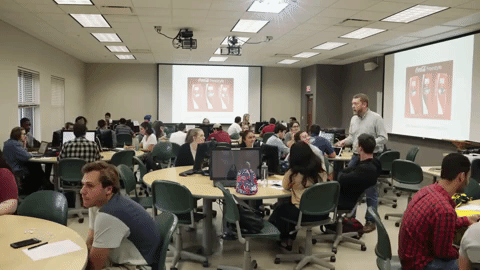
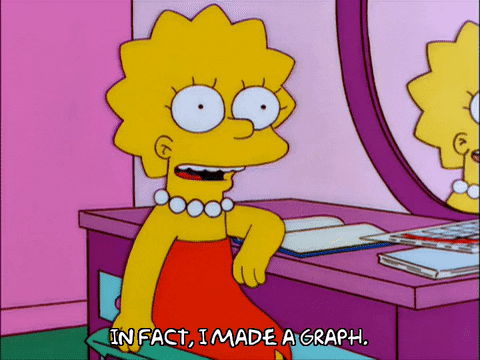
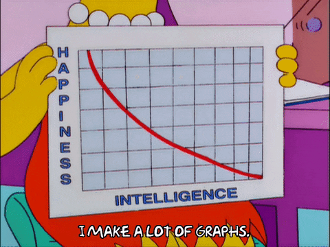

#  Micael Lima - Data Analytics 
<!-- contador de visitas -->

<!--fim contador -->

     
<table>
  <tr>
    <td></td>
    <td></td>
  </tr>
</table>
 

<!-- Sobre me -->

##  About Me:

  <b>"Living is risking everything. Otherwise you are just an inert piece of randomly assembled molecules drifting wherever the universe throws you." - Rick Sanchez</b>

 

I am graduating in <b>Systems Analysis and Development</b> from Unifavip Wyden (2023-) and currently my focus of study has been <b> Data Analysis </b>. I have skills in data analysis with a focus on <b>python</b>, <b>SQL</b>, <b>Power BI</b>, <b>Excel</b>, <b>Machine Learning</b>, <b>Data Visualization</b> and <b>Big Data</b>. I also like learning new things and I seek to improve and develop more skills in the <b>Programming and Data area</b>.

 To learn more about my projects visit my [Data Analyst Portfolio](https://bit.ly/Micael-Lima-Analista-de-dados-Portfolio) 

<!-- Fim sobre me -->

<!-- Areas de estudo -->

  <table>
    <tr>
      <td><b>👨🏽‍🎓 Systems Analyst and Developer </b></td>
      <td><b>👨🏽‍💻 Data Analyst</b></td>
    </tr>
    <tr>
      <td></td>
      <td> </td>
    </tr>
  </table>

<!-- Fim áreas de estudo -->

<!-- Sobre me-->
<b> 
 
###  Beyond programming....</b>

- ☆ I love listening to music on Spotify, especially international music, my preferences are pop, indie and Latin music.
- ☆ I like watching series of all genres and I usually watch sitcoms to familiarize myself with English.
- ☆ I love organization and I like making things visually beautiful, as it improves my efficiency, focus and learning. 
- ☆ I like hiking and spending time outdoors, having time to myself to refresh my mind and practice self-care.
<!-- Fim Sobre me-->

<!-- Lisa Simpsnos -->

  <table>
    <tr>
      <td></td>
      <td></td>
    </tr>
  </table>

<!-- Fim Lisa -->

##  Tools:

       

 
 
  

  

##  Languages:

    
    
   
    
    
    
  
    
    

<!-- Meu avatar -->

<!-- Fim Avatar -->

 ##  Python Libraries:
 

##  Contact:

##   Management:
 
<!-- 
theme=ocean_dark 
tokyonight: 35AFA3 Green | BF91F3 Purple | 1A1B27 Dark 
-->

|  |  |  |
| :-: | :-: | :-: |

|  |  | 
| :-: | :-: |
          

           
          
