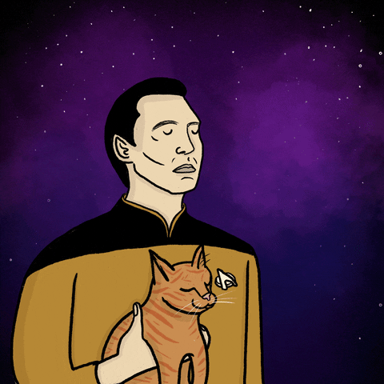

# Olá eu sou Micael 👋👨🏽‍💻
 

  <b>"Tudo o que eu falo é de verdade. Na minha idade, a verdade é a minha liberdade" - Antonio Abujamra</b>

 

Sou graduando em <b>Análise e Desenvolvimento de Sistemas</b> pela Unifavip Wyden (2023-) e atualmente estudo <b> Análise de dados </b> pela EBAC - Escola Britância de Artes Criativas e Tecnologia. Possuo habilidades em análise de dados com foco em <b>python</b> , <b>SQL</b>, <b>Power BI</b>, <b>Machine Learning</b> e <b>Visualização de dados</b>. Também gosto de aprender coisas novas e busco aprimorar e desenvolver mais habilidades  na <b>área de dados</b>.
  

  <table>
    <tr>
      <td><b>🧑🏾‍💻 Analista e desenvovedor de sistemas </b></td>
      <td><b>📊 Analista de dados</b></td>
    </tr>
    <tr>
      <td></td>
      <td> </td>
    </tr>
  </table>

### Ferramentas que eu utilizo 📶:

           
          
