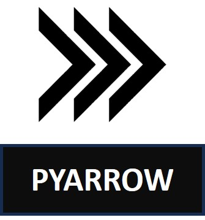

# Micael Lima / Estudante de dados 🎲
<!-- contador de visitas -->

 

<!--fim contador -->

<!-- GIF B99 -->

 <td> </td>
  

<!-- FIM GIF B99 -->

<!-- Sobre me -->

## Sobre Mim ⭐️

  <b>"Viver é arriscar tudo. Caso contrário você é apenas um pedaço inerte de moléculas montadas aleatoriamente à deriva onde o universo te sopra." - Rick Sanchez</b>

 

Sou graduando em <b>Análise e Desenvolvimento de Sistemas</b> pela Unifavip Wyden (2023-) e atualmente meu foco de estudo tem sido <b> Análise de dados </b>. Possuo habilidades em análise de dados com foco em <b>python</b> , <b>SQL</b>, <b>Power BI</b>, <b>Excel</b>, <b>Machine Learning</b>, <b>Visualização de dados</b> e <b>Big Data</b>. Também gosto de aprender coisas novas e busco aprimorar e desenvolver mais habilidades  na <b>área de Programação e Dados</b>.

✧ Para conhecer mais sobre meus projetos acesse meu [Portfólio de Analista de dados](https://bit.ly/Micael-Lima-Analista-de-dados-Portfolio) ✧

<!-- Fim sobre me -->

<!-- Areas de estudo -->

  <table>
    <tr>
      <td><b>👨🏽‍🎓 Analista e Desenvolvedor de Sistemas </b></td>
      <td><b>👨🏽‍💻 Analista de Dados</b></td>
    </tr>
    <tr>
      <td></td>
      <td> </td>
    </tr>
  </table>

<!-- Fim áreas de estudo -->

<!-- Sobre me-->

<b>Além da programação....</b>

- Adoro ouvir música no spotify, principalmente músicas internacionais, tem como preferências músicas pop, indie e latina.
- Gosto de assistir series de todos os gêneros e costumo assistir sitcoms para me familiarizar com inglês.
- Adoro organização e gosto de deixar as coisas visualmente bonitas, pois melhora minha eficiência, foco e aprendizado. 
- Gosto de caminhadas e passar um tempo ao ar livre, ter um tempo comigo mesmo para refrescar a mente e praticar autocuidado. 

<!-- Fim Sobre me-->

<!-- Lisa Simpsnos -->

  <table>
    <tr>
      <td></td>
      <td></td>
    </tr>
  </table>

<!-- Fim Lisa -->

## Ferramentas 📶:

       

  

##  Linguagens 💻:

    
    
    
    
    
    
    

<!-- Meu avatar -->

<!-- Fim Avatar -->

##  Bibliotecas Python 🐍: 

## Gerenciamento  🕒:

<!-- 
theme=ocean_dark 
tokyonight: 35AFA3 Green | BF91F3 Purple | 1A1B27 Dark 
-->

|  |  |  |
| :-: | :-: | :-: |

|  |  |
| :-: | :-: |
          

           
          
