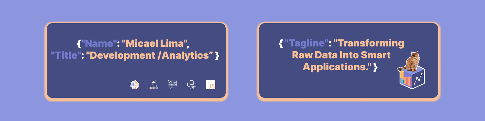
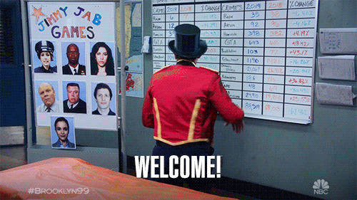
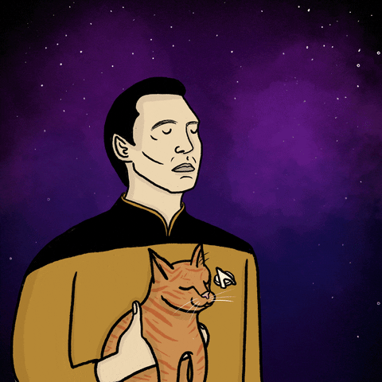
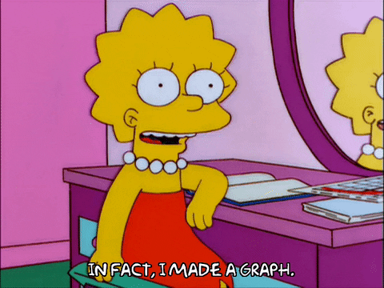
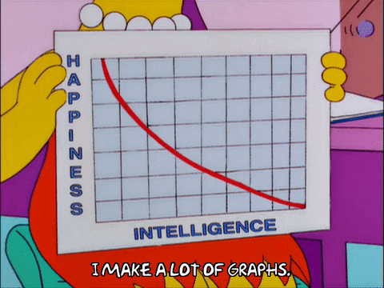

     
<table>
  <tr>
    <td></td>
    <td></td>
  </tr>
</table>
 

##  About Me:

  <b>"But it's not about hitting hard. It's about how much you can take a beating and move on. How much are you able to take and keep trying. That's how you can win." - Rock Balboa</b>

 

☆ 
I have a degree in <b>Systems Analysis and Development</b> from <b>Unifavip Wyden</b> (2023–2025), focusing on <b>Data Analysis</b> and <b>Back-end Development</b>. 
I am currently pursuing a postgraduate specialization in <b>Data Engineering and Artificial Intelligence</b> at <b>XPeriun</b>, further strengthening my expertise in modern data architectures and AI-driven solutions.

I have practical experience with <b>Python</b>, 
<b>Node.js</b>,
<b>React</b>, 
<b>SQL</b>, 
<b>Power BI</b>, 
<b>Excel</b> and <b>Machine Learning</b>, as well as skills in <b>Data Visualization</b>, <b>Big Data Processing</b> and <b>Web/Mobile Development</b>. 
☆

❥ Passionate about technology and self-development, I’m always seeking to expand my knowledge in the fields of <b>Programming</b>, <b>Data Science</b>, and <b>Software Engineering</b>. ❥

 To learn more about my projects visit my [Data Dev Portfolio](https://portfolio-drab-eta-39.vercel.app/) 

  <table>
    <tr>
      <td><b>👨🏽‍🎓 Systems Developer / Data & IA</b></td>
      <td><b>👨🏽‍💻 Data & Developer </b></td>
    </tr>
    <tr>
      <td></td>
      <td> </td>
    </tr>
  </table>

<b> 
 
###  Beyond programming....</b>

-  I love listening to music on Spotify, especially international music, my preferences are pop, indie and Latin music.
-  I like watching series of all genres and I usually watch sitcoms to familiarize myself with English.
-  I love organization and I like making things visually beautiful, as it improves my efficiency, focus and learning. 
-  I like hiking and spending time outdoors, having time to myself to refresh my mind and practice self-care.

  <table>
    <tr>
      <td></td>
      <td></td>
    </tr>
  </table>

##  Tools:

        
  
  
  
  
  
  
  
  
  
  
  
  
  
  
  
  
  
  
  
  
  
  
  
  
  
  

##  Languages:

    
    
   
    
    
    

 ##  Python Libraries:
 

##  Contact:

##   Management:
 

|  |  |  |
| :-: | :-: | :-: |

|  |  | 
| :-: | :-: |
          

