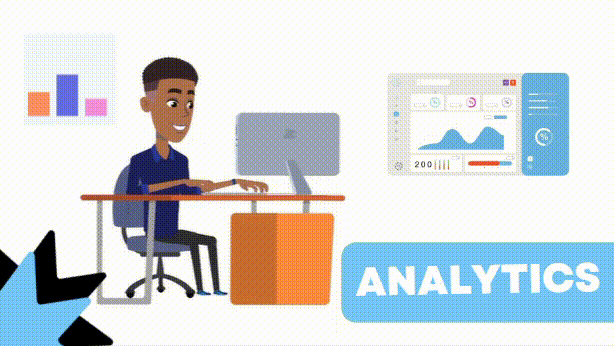

#    Micael José de Lima -  Data & Back-end Developer 
<!-- contador de visitas -->

<!--fim contador -->

     
<table>
  <tr>
    <td></td>
    <td></td>
  </tr>
</table>
 

<!-- Sobre me -->

##  About Me:

  <b>"But it's not about hitting hard. It's about how much you can take a beating and move on. How much are you able to take and keep trying. That's how you can win." - Rock Balboa</b>

 

☆ I am currently pursuing a degree in <b>Systems Analysis and Development</b> at Unifavip Wyden (2023–2025), with a strong focus on <b>Data Analytics</b> and <b>Back-end Development</b>. I have hands-on experience with <b>Python</b>, <b>SQL</b>, <b>Power BI</b>, <b>Excel</b>, and <b>Machine Learning</b>, as well as skills in <b>Data Visualization</b>, <b>Big Data processing</b>, and <b>Web/Mobile Development.  </b> ☆ 

❥ Passionate about technology and self-development, I’m always seeking to expand my knowledge in the fields of <b>Programming</b>, <b>Data Science</b>, and <b>Software Engineering</b>. ❥

 To learn more about my projects visit my [Data Analyst Portfolio](https://bit.ly/Micael-Lima-Analista-de-dados-Portfolio) 

<!-- Fim sobre me -->

<!-- Areas de estudo -->

  <table>
    <tr>
      <td><b>👨🏽‍🎓 Systems Analyst and Developer </b></td>
      <td><b>👨🏽‍💻 Data & Back-end Developer </b></td>
    </tr>
    <tr>
      <td></td>
      <td> </td>
    </tr>
  </table>

<!-- Fim áreas de estudo -->

<!-- Sobre me-->
<b> 
 
###  Beyond programming....</b>

-  I love listening to music on Spotify, especially international music, my preferences are pop, indie and Latin music.
-  I like watching series of all genres and I usually watch sitcoms to familiarize myself with English.
-  I love organization and I like making things visually beautiful, as it improves my efficiency, focus and learning. 
-  I like hiking and spending time outdoors, having time to myself to refresh my mind and practice self-care.
<!-- Fim Sobre me-->

<!-- Lisa Simpsnos -->

  <table>
    <tr>
      <td></td>
      <td></td>
    </tr>
  </table>

<!-- Fim Lisa -->

##  Tools:

       
  
  
  
  
  
  
  
  
  
  
  
  
  
  
  
  
  
  

##  Languages:

    
    
   
    
    
    
  
    
    

<!-- Meu avatar -->

<!-- Fim Avatar -->

 ##  Python Libraries:
 <!--

-->

##  Contact:

##   Management:
 
<!-- 
theme=ocean_dark 
tokyonight: 35AFA3 Green | BF91F3 Purple | 1A1B27 Dark 
-->

|  |  |  |
| :-: | :-: | :-: |

|  |  | 
| :-: | :-: |
          

           
          
